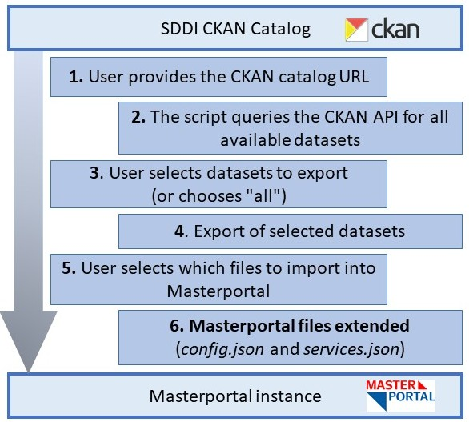

# 🌍 Masterportal SDDI-CKAN Dataset Import Tool

This tool helps you **automatically export WMS datasets from a SDDI CKAN catalog**, generate the necessary `*-config.json` and `*-service.json` files, and inject them directly into your **Masterportal configuration** (`config.json` and `services.json`).

## 📁 Folder Structure

| Path | Description |
|------|-------------|
|`sddi-ckan-to-masterportal/`|Main tool directory|
| └── `sddi-ckan-to-masterportal.py` | Tool that converts CKAN datasets into Masterportal-ready files |
| └── `export/` | Output folder where exported datasets and config files are stored |
| `examples/` | Local clone of the Masterportal (see <https://www.masterportal.org/>) with asample Masterportal setup used for automatic injection of config/service files.|

## 🚀 Features

- ✅ Fetches datasets from a CKAN-compatible catalog
- ✅ Lets you choose datasets interactively
- ✅ Exports datasets into structured JSON files
- ✅ Generates `*-config.json` and `*-service.json` files
- ✅ Imports selected files directly into Masterportal
- ✅ Prevents duplicates in Masterportal configuration

## ⚙️ How to Use
1. Navigate to your project folder:
`cd SDDI-CKAN-API-Dataset_import_export\sddi-ckan-to-masterportal\sddi-ckan-to-masterportal`
2. Run the tool:
`python sddi-ckan-to-masterportal.py`
3. Follow the prompts:
    - `Paste the URL of the CKAN catalog`
    *e.g. https://ckan.example.org*
    - `Select datasets to export`
    *e.g., 1,2,5*
    - `Select which files to import into Masterportal`
    *e.g., 1,2,5*
    - `🌐 Launch local Masterportal preview? (yes/no):`
    *e.g., yes*
    `🚀 Starting local HTTP server at http://localhost:8000`

*Note:* This tool is currently configured for the Munich region and already includes the [DOP20](https://geodatenonline.bayern.de/geodatenonline/seiten/wms_dop20cm) dataset in the Masterportal setup.

## 🧰 Requirements
- Python 3.6+
- Internet connection (for fetching datasets)